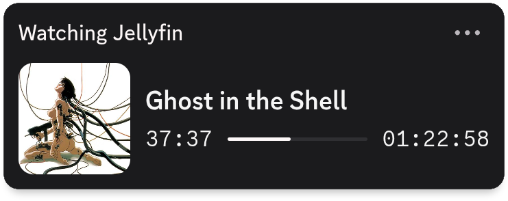
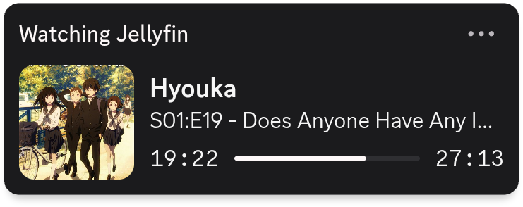

## jellyrpc

a simple jellyfin discord rpc daemon written in golang

<p align="center">
  
    
</p>

supports local and public jellyfin instances, and doesn't require any extra api keys for cover art support on local instances

```md
features:
  - lightweight
  - easy setup
  - supports Quick Connect
  - cover art fetching
```

> local cover art is served by a bridge service (rot.sh) using the media id, it logs nothing and only discord's servers fetch the image

## install

### arch (aur)

```bash
yay -S jellyrpc
```
*replace `yay` with your preferred aur helper (e.g. paru)*

### other

> requires `git`, `go` and `make`

```bash
git clone https://github.com/snowmoe/jellyrpc

cd jellyrpc

make install
```

> the makefile install action only supports unix like operating systems using systemd, non systemd systems will require manual service creation for your init system (e.g. openrc, runit, etc.)

## quick setup

```bash
jellyrpc setup
```

this will run you through the full setup process, and supports Quick Connect for easy setup. alternatively you can use a user token or api key for authentication.

check [troubleshooting](#troubleshooting) if you run into problems

> if something went wrong when you think it shouldn't have, please make an issue with the (redacted) output

## manual setup

create and/or edit the config file at `~/.config/jellyrpc/config`, an example config can be found [here](https://github.com/snowmoe/jellyrpc/blob/main/config.example)

*if you installed from the aur an example file also exists at `/usr/share/doc/jellyrpc/config.example`*

#### set the following (required) values:

- `JELLYFIN_URL` with your jellyfin instance, ensuring you include the protocol
- `JELLYFIN_KEY` with an api key generated under **dashboard > api keys** || see below to use without an api key
- `JELLYFIN_USER` with the jellyfin username of who you want to use the status of

run `jellyrpc check` to verify your config

now you can run `systemctl --user enable --now jellyrpc` to start the daemon

check [troubleshooting](#troubleshooting) if you run into problems

<details>
  <summary>
<strong>if you can't use Quick Connect AND don't have an api key</strong>
  </summary>
<br>
if the jellyfin instance you're using doesn't support Quick Connect and you're unable to get an api key (e.g. friends instance) you can still extract a user token to use instead.
<br><br>

you can fetch this manually by looking at a requests `Authorization` header in devtools, and grabbing at the `Token=""` value

alternatively you can use the below js snippet by pressing F12 and pasting it in the console:

```js
(function() {
    const originalFetch = window.fetch;
    window.fetch = async function(...args) {
        const headers = args[1]?.headers || {};
        const token = headers['X-MediaBrowser-Token'] || headers['Authorization'] || headers['X-Emby-Token'];

        if (token) {
            console.log("jellyfin token:", token.includes('Token=') ? token.split('Token="')[1].split('"')[0] : token);
            window.fetch = originalFetch;
        }
        return originalFetch.apply(this, args);
    };
    console.log("click anything and it should output your token");
})();
```

you can then just use this token in `jellyrpc setup` or for the `JELLYFIN_KEY` option in config
</details>

## config options

|option|default|meaning|
|-|:-:|-|
|*`JELLYFIN_URL`|  | jellyfin instance to use
|*`JELLYFIN_KEY`|  | jellyfin api key or user token
|*`JELLYFIN_USER`|  | jellyfin user(name) to set the watching status of
|`POLL_RATE`| 5 | how often the daemon will poll in seconds
|`PAUSE_TIMEOUT`| 10 | number of minutes idle before stopping rpc (0 = disabled)
|`APP_ID`| *see main.go* | discord app id to use for rpc
|`ARTWORK_SOURCE`| auto | override artwork source for rpc (`jellyfin` or `bridge`)
|`DB_LINK`| false | use rpc title as a link to imdb/tvdb for the episode/movie
|`USE_EPISODE_ART`| false | prefer using per episode cover art (for series')

*required

## usage

`jellyrpc <subcommand>`

|subcommand|description|
|-|-|
|none / `run`|starts the daemon (default)|
|`setup`|runs the setup wizard|
|`check`|tests the config and jellyfin/discord connections|
|`version`|prints the jellyrpc version or commit hash|
|`help`|show usage|

## troubleshooting

- run `jellyrpc check` and verify nothing fails
- otherwise check the logs with `journalctl --user -u jellyrpc -n 30`*

if neither of the above give a clue as to why it's failing then please make an issue! ..and provide logs ..and redact them first

*if you aren't using systemd this will depend on your init system

## manual build

you can build the binary with `make build`, or manually:

```bash
git clone https://github.com/snowmoe/jellyrpc

cd jellyrpc

# embeds the version number (recommended)
go build -ldflags="-s -w -X main.gitVersion=$(git describe --tags --abbrev=0)"

# or build normally
go build -ldflags="-s -w"
```

then configure as normal, and run however you'd like

## update

aur package updates automatically

otherwise run `git pull` in the cloned repo, then `make install` again or rebuild manually

finally restart the service e.g. `systemctl --user restart jellyrpc`
